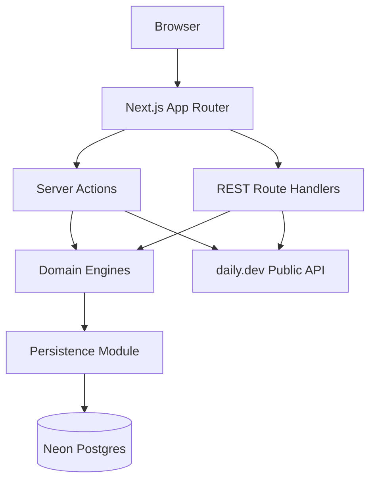
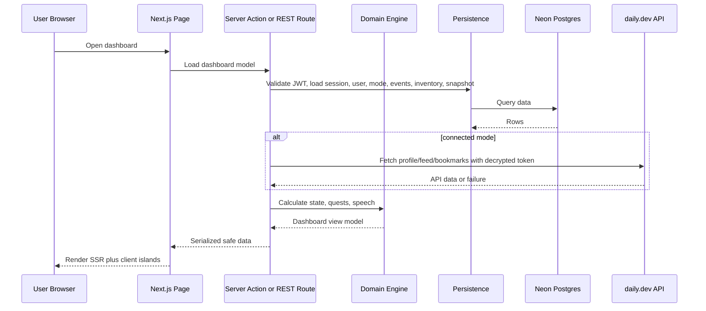
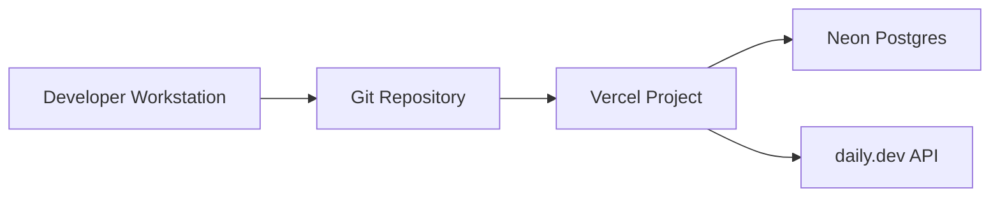

# 2. System Architecture

## 2.1 Architectural style

Devine uses a modular monolith in a single Next.js application. Modules are separated by folder boundaries and public interfaces, but they deploy as one Vercel app backed by Neon Postgres.

## 2.2 Why this shape

A modular monolith fits the hackathon MVP because the product needs fast iteration, one deployable unit, and strict server-side handling of daily.dev tokens. Separate services would add deployment and network complexity without improving the demo path.

## 2.3 High-level component graph

## 2.4 Request lifecycle

## 2.5 Deployment graph

## 2.6 Boundary map

| Module                | Owns                                                     | Public surface                                                                                 | May call                          |
| --------------------- | -------------------------------------------------------- | ---------------------------------------------------------------------------------------------- | --------------------------------- |
| Dashboard UI          | Pages, components, client islands                        | Page routes and typed view models                                                              | Server actions, public API routes |
| Auth                  | Account creation, login, JWT validation, sessions, roles | `registerUser`, `loginUser`, `requireUser`, `requireSuperadmin`, `logoutUser`                  | Persistence, security helpers     |
| daily.dev Integration | External API calls and mapping                           | `validateDailyDevToken`, `fetchDailyDevProfile`, `fetchDailyDevFeed`, `fetchDailyDevBookmarks` | Token security                    |
| Token Security        | Encryption and decryption                                | `encryptToken`, `decryptToken`, `deleteConnection`                                             | Persistence                       |
| Activity Ingestion    | Normalized activity event creation                       | `normalizeActivityEvent`, `recordActivity`                                                     | Scoring, persistence              |
| Scoring Engine        | Energy, health, seniority                                | Pure calculation functions                                                                     | No persistence                    |
| Quest Engine          | Quest generation and rewards                             | Pure quest functions                                                                           | Scoring types                     |
| Power-Up Engine       | Inventory and active effects                             | Pure inventory/effect functions                                                                | Scoring types                     |
| Speech Bubble         | Deterministic copy selection                             | `selectSpeechBubble`                                                                           | Scoring types                     |
| Persistence           | Drizzle schema and queries                               | Repository functions only                                                                      | Neon database                     |
| Share Snapshot        | Static public snapshots                                  | `createShareSnapshot`, share route loader                                                      | Persistence                       |
| Operations            | Health and reset endpoints                               | `GET /health`, `POST /admin/reset-state`                                                       | Persistence, migrations, seeds    |

## 2.7 Cross-module call rule

Modules import only from another module's public `index.ts` or documented public files. A module must not import another module's internal repositories, private components, or implementation files.
