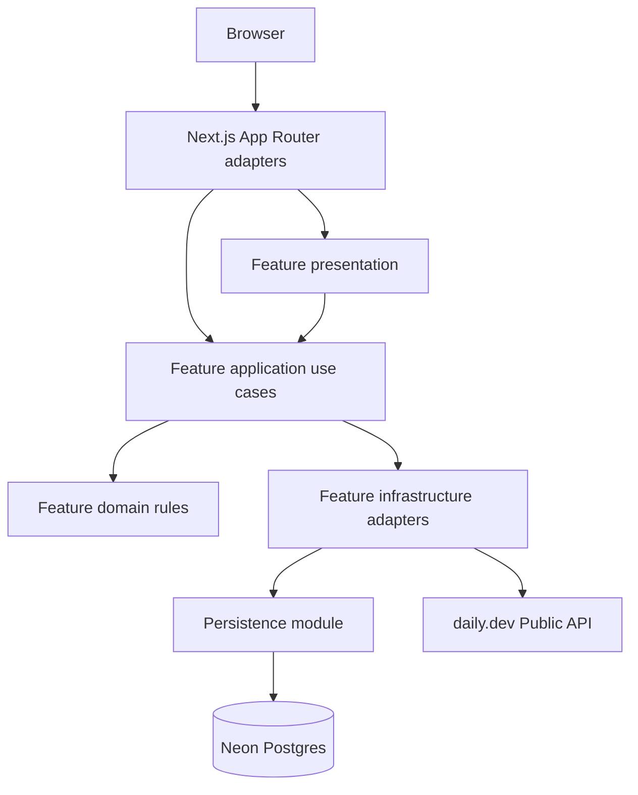
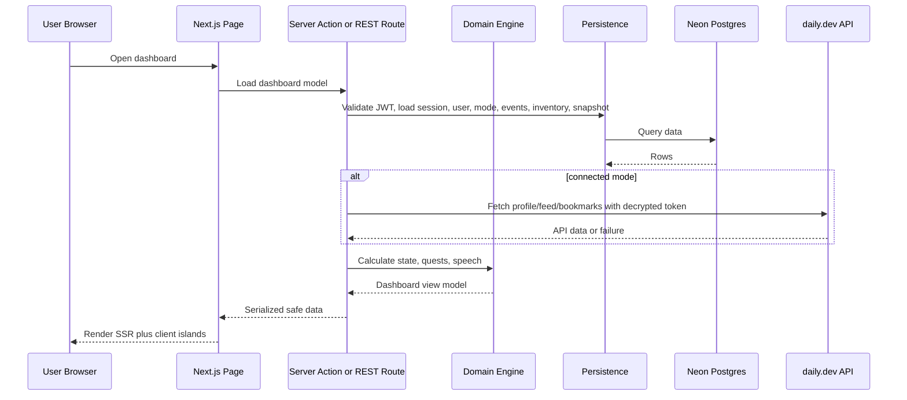
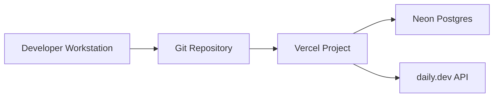

# 2. System Architecture

## 2.1 Architectural style

Devine uses a vertical-slice modular monolith in a single Next.js application. Product features live under `features/<slice>/` with clean architecture layers, while Next.js `app/` files stay as thin HTTP, routing, and server-action adapters. The slices deploy together as one Vercel app backed by Neon Postgres.

## 2.2 Why this shape

A modular monolith fits the hackathon MVP because the product needs fast iteration, one deployable unit, and strict server-side handling of daily.dev tokens. Separate services would add deployment and network complexity without improving the demo path.

## 2.3 High-level component graph

## 2.4 Request lifecycle

## 2.5 Deployment graph

## 2.6 Boundary map

| Module                | Owns                                                     | Public surface                                                                                 | May call                          |
| --------------------- | -------------------------------------------------------- | ---------------------------------------------------------------------------------------------- | --------------------------------- |
| Dashboard UI          | Pages, components, client islands                        | Page routes and typed view models                                                              | Server actions, public API routes |
| Auth                  | Account creation, login, JWT validation, sessions, roles | `registerUser`, `loginUser`, `requireUser`, `requireSuperadmin`, `logoutUser`                  | Persistence, security helpers     |
| daily.dev Integration | External API calls and mapping                           | `validateDailyDevToken`, `fetchDailyDevProfile`, `fetchDailyDevFeed`, `fetchDailyDevBookmarks` | Token security                    |
| Token Security        | Encryption and decryption                                | `encryptToken`, `decryptToken`, `deleteConnection`                                             | Persistence                       |
| Activity Ingestion    | Normalized activity event creation                       | `normalizeActivityEvent`, `recordActivity`                                                     | Scoring, persistence              |
| Scoring Engine        | Energy, health, seniority                                | Pure calculation functions                                                                     | No persistence                    |
| Quest Engine          | Quest generation and rewards                             | Pure quest functions                                                                           | Scoring types                     |
| Power-Up Engine       | Inventory and active effects                             | Pure inventory/effect functions                                                                | Scoring types                     |
| Speech Bubble         | Deterministic copy selection                             | `selectSpeechBubble`                                                                           | Scoring types                     |
| Persistence           | Drizzle schema and queries                               | Repository functions only                                                                      | Neon database                     |
| Share Snapshot        | Static public snapshots                                  | `createShareSnapshot`, share route loader                                                      | Persistence                       |
| Operations            | Health and reset endpoints                               | `GET /health`, `POST /admin/reset-state`                                                       | Persistence, migrations, seeds    |

## 2.7 Clean architecture layers

Each product slice may contain these layers:

| Layer          | Folder                             | Responsibility                                                                                            | Must not import                                                          |
| -------------- | ---------------------------------- | --------------------------------------------------------------------------------------------------------- | ------------------------------------------------------------------------ |
| Domain         | `features/<slice>/domain/`         | Pure state, value objects, finite-state rules, calculations, and privacy projections.                     | React, Next.js, Drizzle, environment variables, cookies, network clients |
| Application    | `features/<slice>/application/`    | Use cases, ports, command/query handlers, result unions, and slice request schemas.                       | Next.js route/page modules, React components, Drizzle client             |
| Infrastructure | `features/<slice>/infrastructure/` | Port implementations, runtime wiring, external API adapters, token/session adapters, repository adapters. | `app/` route/page modules                                                |
| Presentation   | `features/<slice>/presentation/`   | Feature-owned React components, view models, and UI mappers.                                              | Drizzle client and private internals from other slices                   |

## 2.8 Cross-module call rule

Feature-to-feature imports use the other feature's public `features/<slice>/index.ts` exports. `app/` may import public feature APIs and presentation components, but features must not import `app/`. A slice must not import another slice's private `domain`, `application`, `infrastructure`, or `presentation` files unless the exception is documented in this spec.

## 2.9 Persistence boundary

`lib/db/` remains the only place that creates Drizzle clients, defines schema, runs migrations, seeds data, or performs direct database queries. Feature application code depends on ports declared in `features/<slice>/application/ports.ts`; infrastructure adapters implement those ports by calling `lib/db/`.
