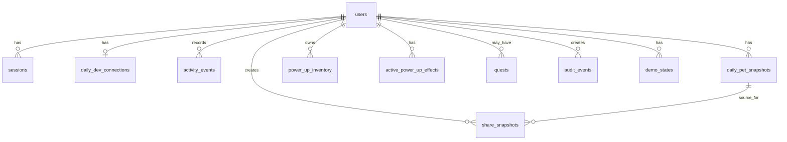
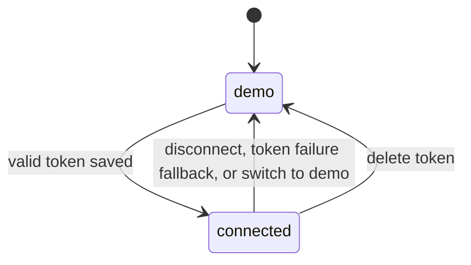
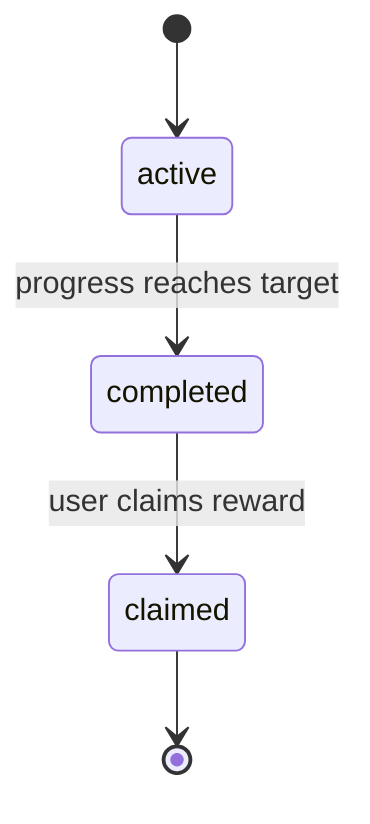
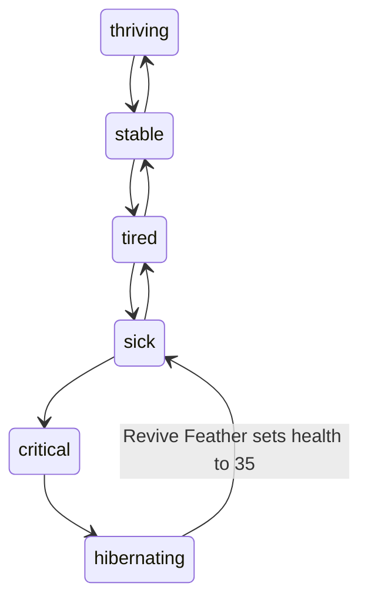

# 6. Data Model

## 6.1 Entity relationship diagram



## 6.2 Common columns

All primary keys are `uuid` strings generated by the application or database. Timestamps are stored as `timestamptz` in UTC. Tables with mutable rows include `created_at` and `updated_at`. Append-only event tables include `created_at` only.

## 6.3 `users`

Stores a Devine account. Serves AC-02.01 through AC-02.17, AC-16.07, AC-20.01, AC-20.02, AC-21.01, and AC-22.01.

| Column                 | Type          | Nullable | Default             | Key             | Notes                                                     | Example                                |
| ---------------------- | ------------- | -------- | ------------------- | --------------- | --------------------------------------------------------- | -------------------------------------- |
| `id`                   | `uuid`        | no       | `gen_random_uuid()` | PK              | Devine account ID.                                        | `8d4b4a8e-0ef3-4b3e-b7f3-2d6d1d7b0e01` |
| `username`             | `text`        | no       | none                | Unique          | Normalized lowercase username.                            | `amaruki`                              |
| `display_username`     | `text`        | no       | none                |                 | User-facing username preserving chosen case where safe.   | `Amaruki`                              |
| `email`                | `text`        | yes      | null                | Unique nullable | Optional recovery email.                                  | `ari@example.com`                      |
| `password_hash`        | `text`        | no       | none                |                 | Argon2id hash string with parameters.                     | `$argon2id$v=19$...`                   |
| `password_updated_at`  | `timestamptz` | no       | `now()`             |                 | Last password change time.                                | `2026-05-23T12:00:00Z`                 |
| `role`                 | `text`        | no       | `'user'`            |                 | `user` or `superadmin`.                                   | `user`                                 |
| `token_version`        | `integer`     | no       | `1`                 |                 | Increment to invalidate existing JWT sessions.            | `1`                                    |
| `timezone`             | `text`        | no       | `'UTC'`             |                 | IANA timezone captured at signup or first dashboard load. | `Asia/Jakarta`                         |
| `daily_dev_handle`     | `text`        | yes      | null                |                 | daily.dev handle if available.                            | `amaruki`                              |
| `daily_dev_profile_id` | `text`        | yes      | null                |                 | daily.dev profile ID if available.                        | `u_123`                                |
| `selected_pet`         | `text`        | no       | `'rubber_duck'`     |                 | MVP supports one pet.                                     | `rubber_duck`                          |
| `mode`                 | `text`        | no       | `'demo'`            |                 | `connected` or `demo`.                                    | `demo`                                 |
| `created_at`           | `timestamptz` | no       | `now()`             |                 | Creation timestamp.                                       | `2026-05-23T12:00:00Z`                 |
| `updated_at`           | `timestamptz` | no       | `now()`             |                 | Last mutation timestamp.                                  | `2026-05-23T12:10:00Z`                 |

## 6.4 `sessions`

Stores active JWT-backed login sessions. Serves AC-02.14 through AC-02.16 and AC-19.07.

| Column          | Type          | Nullable | Default             | Key           | Notes                                       | Example                |
| --------------- | ------------- | -------- | ------------------- | ------------- | ------------------------------------------- | ---------------------- |
| `id`            | `uuid`        | no       | `gen_random_uuid()` | PK            | Session ID included in JWT claims.          | `0f1...`               |
| `user_id`       | `uuid`        | no       | none                | FK `users.id` | Session owner.                              | `8d4...`               |
| `token_version` | `integer`     | no       | none                |               | Must match `users.token_version`.           | `1`                    |
| `expires_at`    | `timestamptz` | no       | none                |               | Seven days after login.                     | `2026-05-30T12:00:00Z` |
| `revoked_at`    | `timestamptz` | yes      | null                |               | Set on logout or forced invalidation.       | null                   |
| `last_seen_at`  | `timestamptz` | yes      | null                |               | Updated on protected access when practical. | `2026-05-23T12:30:00Z` |
| `created_at`    | `timestamptz` | no       | `now()`             |               | Creation timestamp.                         | `2026-05-23T12:00:00Z` |

## 6.5 `daily_dev_connections`

Stores encrypted daily.dev Personal Access Tokens. Serves US-3 through US-5.

| Column              | Type          | Nullable | Default             | Key           | Notes                                              | Example                   |
| ------------------- | ------------- | -------- | ------------------- | ------------- | -------------------------------------------------- | ------------------------- |
| `id`                | `uuid`        | no       | `gen_random_uuid()` | PK            | Connection ID.                                     | `6ad7...`                 |
| `user_id`           | `uuid`        | no       | none                | FK `users.id` | Owner.                                             | `8d4...`                  |
| `encrypted_token`   | `jsonb`       | no       | none                |               | AES-GCM payload with ciphertext, iv, and tag data. | `{ "ciphertext": "..." }` |
| `token_label`       | `text`        | yes      | null                |               | User-visible token label.                          | `daily.dev PAT`           |
| `token_expires_at`  | `timestamptz` | yes      | null                |               | Null if unknown.                                   | null                      |
| `last_validated_at` | `timestamptz` | yes      | null                |               | Last successful validation.                        | `2026-05-23T12:00:00Z`    |
| `created_at`        | `timestamptz` | no       | `now()`             |               | Creation timestamp.                                | `2026-05-23T12:00:00Z`    |
| `updated_at`        | `timestamptz` | no       | `now()`             |               | Last mutation timestamp.                           | `2026-05-23T12:10:00Z`    |

## 6.6 `activity_events`

Stores normalized raw activity events for recalculation. Serves AC-06.01 through AC-06.12, AC-12.01, AC-12.02, AC-16.01, and AC-19.06.

| Column              | Type          | Nullable | Default             | Key                   | Notes                                                | Example                        |
| ------------------- | ------------- | -------- | ------------------- | --------------------- | ---------------------------------------------------- | ------------------------------ |
| `id`                | `uuid`        | no       | `gen_random_uuid()` | PK                    | Event ID.                                            | `3c9...`                       |
| `user_id`           | `uuid`        | no       | none                | FK `users.id`         | Owner.                                               | `8d4...`                       |
| `type`              | `text`        | no       | none                |                       | `read`, `upvote`, `bookmark`, `comment`, or `share`. | `read`                         |
| `source`            | `text`        | no       | none                |                       | `dailydev_api`, `in_app`, `manual`, or `demo`.       | `demo`                         |
| `idempotency_key`   | `text`        | yes      | null                | Unique with `user_id` | Client-generated idempotency key.                    | `read-2026-05-23-post-123`     |
| `dailydev_event_id` | `text`        | yes      | null                | Unique with `user_id` | daily.dev event ID when the API provides one.        | `evt_123`                      |
| `daily_dev_post_id` | `text`        | yes      | null                |                       | Source post ID.                                      | `post_123`                     |
| `post_title`        | `text`        | yes      | null                |                       | Display title.                                       | `Scaling Postgres Queues`      |
| `post_url`          | `text`        | yes      | null                |                       | daily.dev or canonical URL.                          | `https://daily.dev/...`        |
| `tags`              | `jsonb`       | no       | `'[]'`              |                       | Normalized tags.                                     | `["architecture", "database"]` |
| `energy_earned`     | `integer`     | no       | `0`                 |                       | Energy after caps and effects.                       | `10`                           |
| `occurred_at`       | `timestamptz` | no       | none                |                       | Event time.                                          | `2026-05-23T12:00:00Z`         |
| `metadata`          | `jsonb`       | no       | `'{}'`              |                       | Non-sensitive metadata.                              | `{ "demo": true }`             |
| `created_at`        | `timestamptz` | no       | `now()`             |                       | Insert timestamp.                                    | `2026-05-23T12:00:01Z`         |

## 6.7 `daily_pet_snapshots`

Stores calculated daily state. Serves AC-07.01 through AC-08.14, AC-14.01 through AC-14.04, AC-16.02, and AC-22.01.

| Column             | Type          | Nullable | Default             | Key                   | Notes                                                                       | Example                        |
| ------------------ | ------------- | -------- | ------------------- | --------------------- | --------------------------------------------------------------------------- | ------------------------------ |
| `id`               | `uuid`        | no       | `gen_random_uuid()` | PK                    | Snapshot ID.                                                                | `91b...`                       |
| `user_id`          | `uuid`        | no       | none                | FK `users.id`         | Owner.                                                                      | `8d4...`                       |
| `date`             | `date`        | no       | none                | Unique with `user_id` | Snapshot date.                                                              | `2026-05-23`                   |
| `energy_earned`    | `integer`     | no       | `0`                 |                       | Energy for the date.                                                        | `18`                           |
| `health`           | `integer`     | no       | `62`                |                       | 0 through 100.                                                              | `62`                           |
| `health_state`     | `text`        | no       | none                |                       | `thriving`, `stable`, `tired`, `sick`, `critical`, `hibernating`.           | `stable`                       |
| `seniority_score`  | `integer`     | no       | `0`                 |                       | 0 through 100.                                                              | `42`                           |
| `seniority_level`  | `text`        | no       | none                |                       | `ignorant_copaster`, `code_monkey`, `grounded_scholar`, `tech_philosopher`. | `code_monkey`                  |
| `score_breakdown`  | `jsonb`       | no       | `'{}'`              |                       | Component scores.                                                           | `{ "readingConsistency": 24 }` |
| `completed_quests` | `jsonb`       | no       | `'[]'`              |                       | Completed quest keys for date.                                              | `["feed_the_duck"]`            |
| `power_ups_earned` | `jsonb`       | no       | `'[]'`              |                       | Earned rewards for date.                                                    | `["snack"]`                    |
| `created_at`       | `timestamptz` | no       | `now()`             |                       | Creation timestamp.                                                         | `2026-05-23T12:00:00Z`         |
| `updated_at`       | `timestamptz` | no       | `now()`             |                       | Last mutation timestamp.                                                    | `2026-05-23T12:10:00Z`         |

## 6.8 `power_up_inventory`

Stores power-up counts. Serves AC-10.01 through AC-10.07 and AC-16.03.

| Column       | Type          | Nullable | Default             | Key                   | Notes                    | Example                |
| ------------ | ------------- | -------- | ------------------- | --------------------- | ------------------------ | ---------------------- |
| `id`         | `uuid`        | no       | `gen_random_uuid()` | PK                    | Inventory row ID.        | `a10...`               |
| `user_id`    | `uuid`        | no       | none                | FK `users.id`         | Owner.                   | `8d4...`               |
| `type`       | `text`        | no       | none                | Unique with `user_id` | Power-up type.           | `snack`                |
| `quantity`   | `integer`     | no       | `0`                 |                       | Non-negative count.      | `2`                    |
| `created_at` | `timestamptz` | no       | `now()`             |                       | Creation timestamp.      | `2026-05-23T12:00:00Z` |
| `updated_at` | `timestamptz` | no       | `now()`             |                       | Last mutation timestamp. | `2026-05-23T12:10:00Z` |

## 6.9 `active_power_up_effects`

Stores one-shot multipliers. Serves AC-10.04, AC-10.05, and AC-16.03.

| Column              | Type          | Nullable | Default             | Key           | Notes                              | Example                |
| ------------------- | ------------- | -------- | ------------------- | ------------- | ---------------------------------- | ---------------------- |
| `id`                | `uuid`        | no       | `gen_random_uuid()` | PK            | Effect ID.                         | `e42...`               |
| `user_id`           | `uuid`        | no       | none                | FK `users.id` | Owner.                             | `8d4...`               |
| `type`              | `text`        | no       | none                |               | `knowledge_gem` or `social_boost`. | `knowledge_gem`        |
| `applies_to_action` | `text`        | no       | none                |               | `read`, `comment`, or `share`.     | `read`                 |
| `multiplier`        | `numeric`     | no       | `2`                 |               | Energy multiplier.                 | `2`                    |
| `expires_at`        | `timestamptz` | yes      | null                |               | Null for next matching event only. | null                   |
| `created_at`        | `timestamptz` | no       | `now()`             |               | Creation timestamp.                | `2026-05-23T12:00:00Z` |

## 6.10 `quests`

Optional persisted quest state. Static config remains in code. Serves AC-09.01 through AC-09.06 and AC-16.04.

| Column            | Type          | Nullable | Default             | Key           | Notes                                 | Example                |
| ----------------- | ------------- | -------- | ------------------- | ------------- | ------------------------------------- | ---------------------- |
| `id`              | `uuid`        | no       | `gen_random_uuid()` | PK            | Quest row ID.                         | `q12...`               |
| `user_id`         | `uuid`        | no       | none                | FK `users.id` | Owner.                                | `8d4...`               |
| `quest_key`       | `text`        | no       | none                |               | Static quest key.                     | `feed_the_duck`        |
| `type`            | `text`        | no       | none                |               | `daily`, `personalized`, or `weekly`. | `daily`                |
| `status`          | `text`        | no       | `'active'`          |               | `active`, `completed`, or `claimed`.  | `active`               |
| `progress`        | `integer`     | no       | `0`                 |               | Current progress.                     | `2`                    |
| `target`          | `integer`     | no       | none                |               | Required progress.                    | `3`                    |
| `reward_power_up` | `text`        | no       | none                |               | Reward type.                          | `snack`                |
| `date_scope`      | `text`        | no       | none                |               | Date or ISO week key.                 | `2026-05-23`           |
| `created_at`      | `timestamptz` | no       | `now()`             |               | Creation timestamp.                   | `2026-05-23T12:00:00Z` |
| `updated_at`      | `timestamptz` | no       | `now()`             |               | Last mutation timestamp.              | `2026-05-23T12:10:00Z` |

## 6.11 `share_snapshots`

Stores static public cards. Serves AC-14.01 through AC-14.10 and AC-19.08.

| Column                  | Type          | Nullable | Default             | Key                         | Notes                          | Example                                                    |
| ----------------------- | ------------- | -------- | ------------------- | --------------------------- | ------------------------------ | ---------------------------------------------------------- |
| `id`                    | `uuid`        | no       | `gen_random_uuid()` | PK                          | Snapshot row ID.               | `s10...`                                                   |
| `public_id`             | `text`        | no       | generated           | Unique                      | URL-safe public ID.            | `devine_abc123`                                            |
| `user_id`               | `uuid`        | no       | none                | FK `users.id`               | Owner, never exposed publicly. | `8d4...`                                                   |
| `daily_pet_snapshot_id` | `uuid`        | no       | none                | FK `daily_pet_snapshots.id` | Source daily state.            | `91b...`                                                   |
| `seniority_level`       | `text`        | no       | none                |                             | Copied static value.           | `grounded_scholar`                                         |
| `seniority_score`       | `integer`     | no       | none                |                             | Copied static value.           | `67`                                                       |
| `health_state`          | `text`        | no       | none                |                             | Copied static value.           | `stable`                                                   |
| `top_tags`              | `jsonb`       | no       | `'[]'`              |                             | Top 1 to 3 safe tags.          | `["architecture", "ai"]`                                   |
| `speech_bubble`         | `text`        | no       | none                |                             | Safe public quote.             | `My duck stopped saying it works on my machine this week.` |
| `generated_at`          | `timestamptz` | no       | `now()`             |                             | Snapshot generation time.      | `2026-05-23T12:00:00Z`                                     |
| `created_at`            | `timestamptz` | no       | `now()`             |                             | Insert timestamp.              | `2026-05-23T12:00:00Z`                                     |

## 6.12 `demo_states`

Stores server-persisted demo persona state per authenticated user. Serves AC-04.01 through AC-04.07, AC-16.05, AC-18.01 through AC-18.06, AC-20.01, and AC-20.02.

| Column       | Type          | Nullable | Default             | Key                  | Notes                                                   | Example                |
| ------------ | ------------- | -------- | ------------------- | -------------------- | ------------------------------------------------------- | ---------------------- |
| `id`         | `uuid`        | no       | `gen_random_uuid()` | PK                   | Demo state row ID.                                      | `d10...`               |
| `user_id`    | `uuid`        | no       | none                | Unique FK `users.id` | Owner.                                                  | `8d4...`               |
| `persona`    | `text`        | no       | `'code_monkey'`     |                      | `copaster`, `code_monkey`, `scholar`, or `philosopher`. | `code_monkey`          |
| `state`      | `jsonb`       | no       | `'{}'`              |                      | Persisted simulation state and prepared demo metadata.  | `{ "path": "judge" }`  |
| `reset_at`   | `timestamptz` | yes      | null                |                      | Last demo reset time.                                   | `2026-05-23T12:00:00Z` |
| `created_at` | `timestamptz` | no       | `now()`             |                      | Creation timestamp.                                     | `2026-05-23T12:00:00Z` |
| `updated_at` | `timestamptz` | no       | `now()`             |                      | Last mutation timestamp.                                | `2026-05-23T12:10:00Z` |

## 6.13 `audit_events`

Stores security, support, demo, and retention audit events. Serves AC-16.09, AC-19.07, AC-19.08, AC-20.02, and AC-21.01.

| Column           | Type          | Nullable | Default             | Key           | Notes                                                                                                                                                                                                                                       | Example                        |
| ---------------- | ------------- | -------- | ------------------- | ------------- | ------------------------------------------------------------------------------------------------------------------------------------------------------------------------------------------------------------------------------------------- | ------------------------------ |
| `id`             | `uuid`        | no       | `gen_random_uuid()` | PK            | Audit event ID.                                                                                                                                                                                                                             | `aud_123`                      |
| `actor_user_id`  | `uuid`        | yes      | null                | FK `users.id` | Acting user or superadmin.                                                                                                                                                                                                                  | `8d4...`                       |
| `target_user_id` | `uuid`        | yes      | null                | FK `users.id` | Affected user when different.                                                                                                                                                                                                               | `9a1...`                       |
| `type`           | `text`        | no       | none                |               | `login_success`, `failed_login`, `token_connect`, `token_validation_failure`, `disconnect`, `snapshot_create`, `snapshot_delete`, `demo_reset`, `quest_reward_grant`, `power_up_use`, `account_recovery_request`, or `judge_account_reset`. | `login_success`                |
| `metadata`       | `jsonb`       | no       | `'{}'`              |               | Redacted event metadata.                                                                                                                                                                                                                    | `{ "username": "judge_demo" }` |
| `created_at`     | `timestamptz` | no       | `now()`             |               | Insert timestamp.                                                                                                                                                                                                                           | `2026-05-23T12:00:00Z`         |

## 6.14 State machines

### 6.14.1 User mode



### 6.14.2 Quest status



### 6.14.3 Health state



## 6.15 Migrations and seeding

Migrations and seeds run through Bun scripts. The migration runner resolves the migrations folder relative to its own module, reads the connection string from `DATABASE_URL`, and applies changes through Drizzle's migration ledger.

```ts
import { migrate } from "drizzle-orm/neon-http/migrator";
import { join } from "node:path";
import { db } from "./client";

await migrate(db, { migrationsFolder: join(import.meta.dir, "migrations") });
```

Forbidden pattern: hardcoded absolute migration paths, inline connection strings, and raw reads of one `.sql` file for schema application. That bypasses the migration ledger and breaks in minimal deployment environments.

Stable commands:

```json
{
  "db:migrate": "bun run lib/db/migrate.ts",
  "db:seed:dev": "bun run lib/db/seed.ts dev",
  "db:seed:qa": "bun run lib/db/seed.ts qa"
}
```

Dev and QA seeds are separate, idempotent, version-controlled scripts. The reset-state endpoint selects only `dev` or `qa` and never accepts an arbitrary file path.
